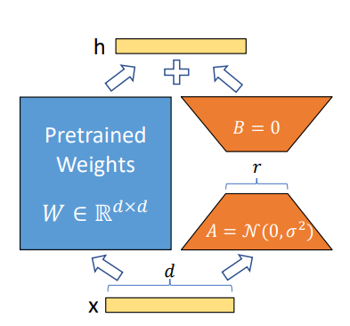

# LoRA-QLoRA-studies

##  Introduction

This project studies **parameter-efficient fine-tuning** under Colab-limited-scale compute constraints. It includes:

-  review of LoRA and QLoRA paper
-  **Manual LoRA implementation** in PyTorch 
-  **Comparative analysis** with PEFT-based LoRA/QLoRA implementations
-  **Empirical evaluation** of how rank, target modules, and quantization affect:
  - Memory usage
  - Training convergence
  - Validation loss

This is ideal for understanding how parameter-efficient fine-tuning works under practical, resource-limited settings.

---

## LoRA: Low-Rank Adaptation

**Low-Rank Adaptation (LoRA)** fine-tunes large pretrained models by freezing the original weights and training only small low-rank matrices instead of updating all parameters.

### How LoRA Works

For a weight matrix $W_0 \in \mathbb{R}^{d \times k}$, LoRA models the task-specific update as:

$$W = W_0 + \Delta W, \qquad \Delta W = \frac{\alpha}{r}BA$$

Where:

- $W_0$ is **frozen** (not updated)
- $A \in \mathbb{R}^{r \times k}$ – low-rank matrix (trainable)
- $B \in \mathbb{R}^{d \times r}$ – low-rank matrix (trainable)
- $r \ll \min(d,k)$ – the low rank (typically 8–64)
- $\alpha$ – scaling factor (hyperparameter)



---

## Quantization Fundamentals

Quantization represents real-valued tensors using a smaller set of discrete values, reducing memory and compute costs.

### Basic Quantization Process

For a real value $x \in \mathbb{R}$:

$$q = \mathrm{Quantize}(x), \qquad \hat{x} = \mathrm{Dequantize}(q)$$
- $x$ is quantized to $q$ (a discrete value), and $q$ is stored
- when computing, $q$ is dequantized back to $\hat{x}$ (an approximation)

**The Role of the Quantization Scale $s$:**

The scale $s$ is a **normalization factor** that maps continuous floating-point values to a discrete integer space. It represents the **step size** in the quantized representation:

- **Quantization**: Divide the original value by $s$ to get a normalized value, then round to an integer
- **Dequantization**: Multiply the integer back by $s$ to reconstruct an approximation of the original value

**Why a scale is needed:**
- Floating-point values have arbitrary magnitudes (e.g., 0.5, 1.234, 1000.7)
- We need to map them into a bounded integer range (e.g., -128 to 127 for 8-bit, -8 to 7 for 4-bit)
- The scale adapts to the data's magnitude, ensuring all values fit in the target range

**Symmetric quantization** uses a single scale $s$:

$$q = \mathrm{round}\left(\frac{x}{s}\right), \qquad \hat{x} = s \cdot q$$

The scale is typically chosen as:

$$s = \frac{\max(|x|)}{q_{\max}}$$

where $q_{\max}$ is the largest representable integer (e.g., 127 for 8-bit signed, 7 for 4-bit signed).

**Concrete Example: 8-bit Quantization**

Given a list of float values:
$$\mathbf{x} = [0.5, 1.234, -2.1, 3.5, 0.1, -1.8, 2.7, -0.3]$$

For **8-bit signed integers**, the range is $[-128, 127]$ (so $q_{\max} = 127$).

**Step 1:** Find the scale

$$\max(|x|) = \max(0.5, 1.234, 2.1, 3.5, 0.1, 1.8, 2.7, 0.3) = 3.5$$

$$s = \frac{3.5}{127} \approx 0.0276$$

**Step 2:** Quantize each value
$$q_i = \mathrm{round}\left(\frac{x_i}{s}\right)$$

| Original | $x / s$ | Quantized $q$ |
|----------|---------|---------------|
| 0.5      | 18.1    | 18            |
| 1.234    | 44.7    | 45            |
| -2.1     | -76.1   | -76           |
| 3.5      | 126.8   | 127           |
| 0.1      | 3.6     | 4             |
| -1.8     | -65.2   | -65           |
| 2.7      | 97.8    | 98            |
| -0.3     | -10.9   | -11           |

**Step 3:** Dequantize back to float
$$\hat{x}_i = s \cdot q_i$$

| Quantized $q$ | Reconstructed $\hat{x}$ | Error $x - \hat{x}$ |
|---------------|------------------------|---------------------|
| 18            | 0.497                  | 0.003               |
| 45            | 1.242                  | -0.008              |
| -76           | -2.098                 | -0.002              |
| 127           | 3.502                  | -0.002              |
| 4             | 0.110                  | -0.010              |
| -65           | -1.794                 | -0.006              |
| 98            | 2.704                  | -0.004              |
| -11           | -0.304                 | 0.004               |

**Key observations:**
- Quantized values fit in 8-bit integer range (only 1 byte each instead of 4 or 8 bytes for float)
- Reconstruction error is small (< 0.01 per value)
- The scale adapts to the data magnitude (0.0276 in this case)

With value clamping:

$$q = \mathrm{clip}\left(\mathrm{round}\left(\frac{x}{s}\right), q_{\min}, q_{\max}\right)$$

This clips the quantized value within $[q_{\min}, q_{\max}]$ to handle outliers.

**Quantization error**:

$$e = x - \hat{x}$$

In uniform quantizers, error is typically bounded by ~half a step size. Fewer bits = more quantization error, but less memory.
Therefore, when you do quantization, you need to think of performance-memory tradeoff considering how much correctness is required with given memory size.

---

## Why 16-bit Computation Instead of 32-bit?

**FP32** provides high numerical precision but uses significant memory and bandwidth. For large language models, this becomes a major bottleneck.

**Mixed-precision training** stores or computes in lower precision (16-bit) while maintaining numerical stability through careful scaling. This dramatically reduces memory footprint and improves training speed.

---

## Floating-Point Formats

A floating-point number has three components:

- **Sign**: positive or negative
- **Exponent**: the scale/magnitude
- **Fraction (Mantissa)**: precision bits

### FP32 (32-bit float)

```
  +---+----------------+----------------+
  | S |    Exponent    |    Fraction    |
  +---+----------------+----------------+
    1        8               23
```

### FP16 (16-bit float)

```
  +---+-------------------+-------------------+
  | S |     Exponent      |      Fraction     |
  +---+-------------------+-------------------+
    1          5                 10
```

**vs. FP32:**
- ❌ Smaller representable range (fewer exponent bits)
- ❌ Lower precision (fewer fraction bits)
- ✅ Less memory required

### BF16 (Brain Floating Point)

```
  15                    7                      0
  +---+-------------------+--------------------+
  | S |     Exponent      |      Fraction      |
  +---+-------------------+--------------------+
    1          8                  7
```

**Key difference:**
- ✅ **Same exponent size as FP32** → preserves numeric range
- ❌ Fewer fraction bits → lower precision

**When BF16 is useful:**
- Range is critical
- Memory/compute reduction is needed
- Many large model frameworks default to BF16

---

## From Floating-Point to 4-bit Quantization

QLoRA applies quantization aggressively: **pretrained weights are stored in 4-bit**, but are **dequantized to 16-bit for actual computation**.

### QLoRA Workflow

$$\text{Store in 4-bit} \rightarrow \text{Dequantize to 16-bit} \rightarrow \text{Compute in 16-bit}$$

This combines:
- Frozen 4-bit quantized pretrained weights (compact storage)
- Low-rank LoRA adapters (trainable)
- Dramatic memory savings with minimal accuracy loss

---

## Blockwise Quantization

A single global scale can be inefficient—one outlier forces a large scale, wasting precision elsewhere. **Blockwise quantization** divides the tensor into blocks and computes a separate scale per block.

For tensor $X$ split into blocks $X^{(1)}, X^{(2)}, \dots$:

$$q^{(b)} = \mathrm{round}\!\left(\frac{X^{(b)}}{s_b}\right), \qquad \hat{X}^{(b)} = s_b \cdot q^{(b)}$$

Each block adapts to its own value range, providing better fidelity than global quantization.

---

## How Quantization Scales Are Chosen

The choice of quantization scale $s_b$ is critical for minimizing information loss. The QLoRA paper discusses several approaches:

### 1. Absolute Maximum (AbsMax) Method

The simplest approach uses the absolute maximum value in each block:

$$s_b = \frac{\max(|X^{(b)}|)}{q_{\max}}$$

Where $q_{\max}$ is the maximum representable quantized value (e.g., 7 for 4-bit signed, 15 for 4-bit unsigned).

**Pros:**
- Simple to compute
- Symmetric scaling around zero
- Preserves the full range

**Cons:**
- Sensitive to outliers
- Wastes precision if one extreme value dominates

### 2. Percentile Method

To reduce outlier sensitivity, scales can be computed using percentiles:

$$s_b = \frac{\mathrm{percentile}(|X^{(b)}|, p)}{q_{\max}}$$

Common choices: 99.9th or 99.95th percentile.

**Pros:**
- Robust to outliers
- Better precision utilization for the majority of values

**Cons:**
- Sacrifices precision at the tails
- Slight information loss for extreme values

### 3. Quantile-Based Selection (QLoRA Standard)

QLoRA's approach uses **quantile-aligned scales** combined with the NormalFloat (NF4) codebook:

- For **NF4 codebook**: scales are chosen such that the 16 code points align with quantiles of the standard normal distribution
- The scale $s_b$ is determined from the data distribution to match expected value ranges

This aligns the quantization grid with actual weight distributions rather than arbitrary uniform spacing.

$$s_b = \frac{q_{99.95}}{q_{\text{max}}}$$

Where $q_{99.95}$ is the 99.95th percentile of absolute values in the block.

**Why this works:**
- Transformer weights follow approximately normal distributions
- Allocates more precision to high-probability regions
- Leaves tail regions slightly quantized but acceptable

---

## ⚠️ Why Plain 4-bit Is Hard

4-bit quantization has only $2^4 = 16$ possible codes—an extremely limited alphabet. Uniformly spaced codes lead to large quantization errors, especially problematic for pretrained weights which have non-uniform distributions.

**Key insight**: Pretrained transformer weights are approximately **normally distributed and zero-centered**, so a 4-bit codebook should match this distribution rather than use uniform spacing.

---

## NF4: NormalFloat 4-bit

**NF4 (NormalFloat 4-bit)** chooses 16 representable values aligned with a standard normal distribution $\mathcal{N}(0,1)$, rather than evenly spaced integers.

Code points are placed at **quantiles of the normal distribution**, so each bin represents equal probability mass.

### Why NF4 Is Better

- **Many weights cluster near zero** → allocate more precision there
- **Fewer weights in tails** → allocate less precision there
- **Better for transformer weights** than uniform Int4 or FP4

This adaptive quantization is essential for effective 4-bit QLoRA.

---

## Double Quantization

Blockwise quantizers store scales for each block. For block size $B$ with 32-bit scales, the overhead is:

$$\frac{32}{B} \text{ bits/parameter}$$

For $B = 64$: $\frac{32}{64} = 0.5$ bits/parameter.

**Double quantization** quantizes the scales themselves. QLoRA reports average overhead:

$$\frac{8}{64} + \frac{32}{64 \times 256} = 0.127 \text{ bits/parameter}$$

This saves $\sim 0.373$ bits/parameter, compressing not just weights but also reconstruction metadata.

---

## QLoRA in One Sentence

**QLoRA fine-tunes a frozen 4-bit quantized pretrained model by dequantizing weights to 16-bit for computation and training low-rank LoRA adapters on the frozen backbone.**

---

## 📚 References

- **Hu et al.** (2021), *LoRA: Low-Rank Adaptation of Large Language Models*  
  https://arxiv.org/abs/2106.09685

- **Dettmers et al.** (2023), *QLoRA: Efficient Finetuning of Quantized LLMs*  
  https://arxiv.org/abs/2305.14314
